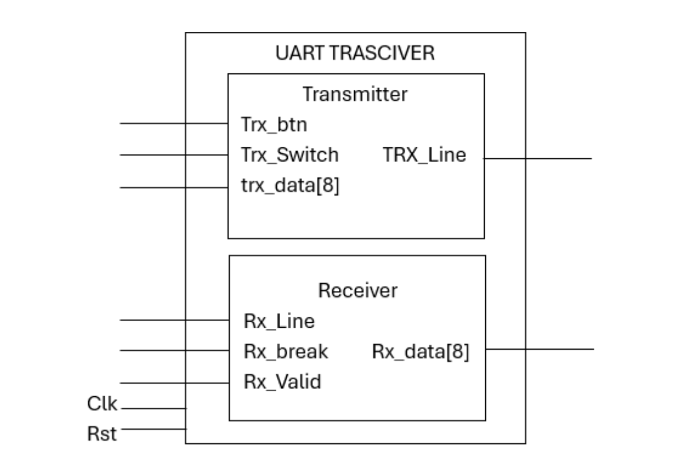

  
# 8-bit UART Transceiver

<p float="left">
 
</p>
  
## Overview

This project implements an 8-bit UART transceiver capable of transmitting and receiving serial data. The design was developed as part of an 8th semester project and served as a submodule of our Final Year Project (FYP). This project was submitted to Efabless for fabrication and marks the first-ever fabricated chip designed by students at Ghulam Ishaq Khan Institute of Engineering Sciences and Technology (GIK). The project was developed by [Saad](https://github.com/theuppercaseguy) and [Saim](https://github.com/m-saim-iqbal).

### [Final Year Project (FYP)](https://github.com/theuppercaseguy/FYP--Risc-V-32-bit-Matrix-Mac)


## Features

- **8-bit Data Transmission and Reception**
- **Debounced Push Button for Data Transmission**
- **Switch Controlled Data Transmission**
- **50 MHz Clock Input**
- **9600 Baud Rate**
- **Receiver Validity and Break Detection**
- **LED Output to Display Received Data**
- **Efficient Clock Divider**

## Team Members

-  [Saad](https://github.com/theuppercaseguy)
- [Saim](https://github.com/m-saim-iqbal)

## Project Milestones

- Developed in the 8th semester.
- Submitted to Efabless for fabrication.
- First fabricated chip by GIK's students.

## Module Description

### Top Module: UART

```verilog
module UART (
    input clk_in, rst_n, 
    input Transmit_btn,  // Push button used to transmit data
    input Tansmit_switch,
    input [7:0] data,  // Input data for transmitting
        
    input wire uart_rxd,  // Receiver line for the receiver module
    
    output wire [7:0] rx_leds,
    output TxD,
    output uart_rx_break,  // Did we get a BREAK message?
    output uart_rx_valid  // Valid data received and available.
);
```

- Clock Divider: Generates a 50 MHz clock from a 100 MHz input clock.
-  Debouncer: Debounces the push button used for transmitting data.
- Transmitter: Handles data transmission over the UART line.
- Receiver: Receives serial data and displays it on LEDs.

## Receiver Parameters
- CLK_HZ: 50 MHz system clock
- BIT_RATE: 9600 baud rate
- PAYLOAD_BITS: 8-bit payload
- Receiver Implementation

```
receiver #(
    .BIT_RATE(BIT_RATE),
    .PAYLOAD_BITS(PAYLOAD_BITS),
    .CLK_HZ(CLK_HZ)
) i_uart_rx(
    .clk(clk),  // Top level system clock input.
    .resetn(rst_n),  // Asynchronous active low reset.
    .uart_rxd(uart_rxd),  // UART Receive pin.
    .uart_rx_en(1'b1),  // Receive enable
    .uart_rx_break(uart_rx_break),  // Did we get a BREAK message?
    .uart_rx_valid(uart_rx_valid),  // Valid data received and available.
    .uart_rx_data(uart_rx_data)  // The received data.
);

```

# Getting Started
## Prerequisites
- Verilog Simulator
- FPGA Development Board (if testing on hardware)
Installation

1. Clone the Repo
2. add the files to a vivado project
3. execute the testbench for testing
4. create a bitstream file from vivado for using on FPGA board
5. dont forget to change the constraint files for your FPGA board


# Contribution Guidelines
We welcome contributions to enhance the functionality and performance of the UART transceiver. If you wish to contribute, please follow these guidelines:

- Fork the repository and create a new branch.
- Make your changes and ensure they adhere to coding standards.
- Test thoroughly and provide clear commit messages.
- Submit a pull request detailing your changes.


# Contact
For questions, suggestions, or support regarding the 8-bit UART transceiver, please contact:

Saad - [saadan06@gmail.com]
Saim - [Iqbal.msaim@gmail.com]

# Acknowledgements
- Special thanks to our university, Ghulam Ishaq Khan Institute of Engineering Sciences and Technology (GIK), for their support.
- Thanks to Efabless for providing the fabrication platform.


